# Active Directory Home Lab

Virtual Windows Server administration environment created in VirtualBox for practicing Active Directory, Group Policy and networking administration.

---

# Technologies

- Windows Server 2022
- Active Directory
- Group Policy (GPO)
- DNS
- Windows 10
- VirtualBox

---

# Project Tasks

## User Management

- Created and managed Active Directory users
- Reset user passwords
- Disabled and unlocked user accounts
- Managed group memberships and permissions

---

## Group Policy (GPO)

Configured Group Policies such as:

- Desktop wallpaper policy
- Blocking Control Panel access
- Password policies
- User restrictions

---

## Networking

- Configured static IP addresses
- Configured DNS settings
- Tested network connectivity using ping
- Verified communication between virtual machines

---

# Skills Practiced

- Windows Server administration
- Active Directory management
- Group Policy configuration
- User and permission management
- Networking fundamentals
- IT support troubleshooting

---

# Screenshots

## Active Directory Users and Computers

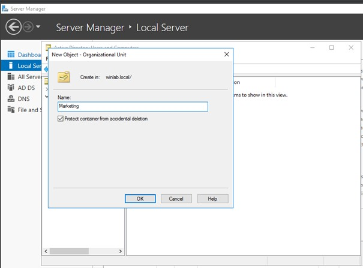
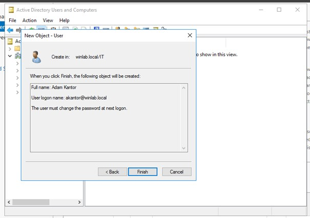
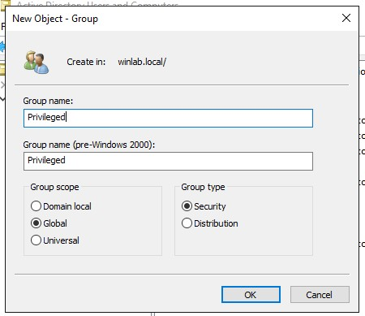
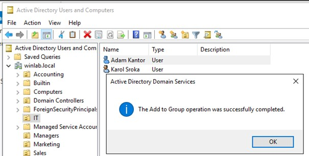
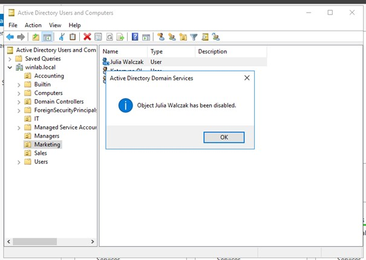

---

## Group Policy Management

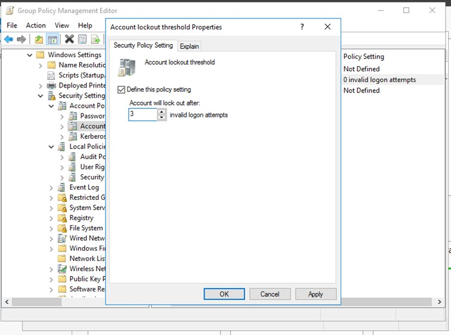
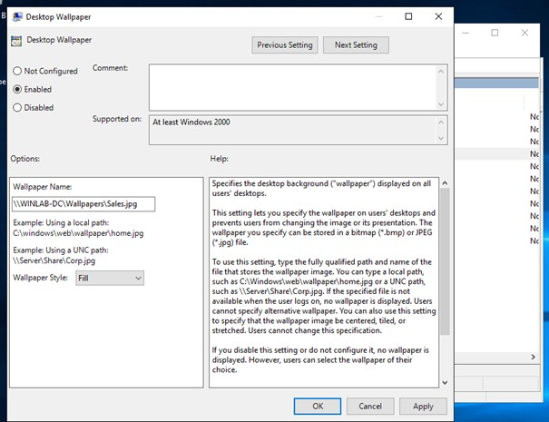
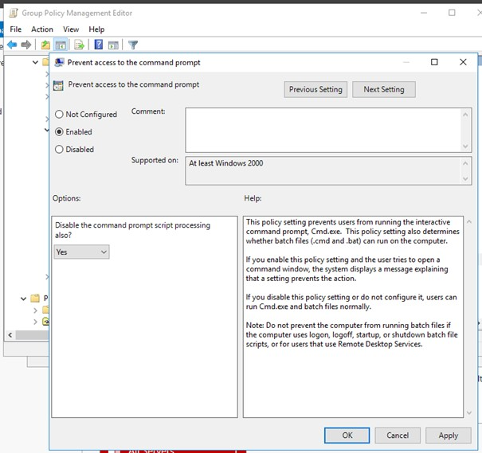

---

## Network Configuration

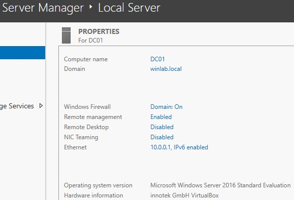

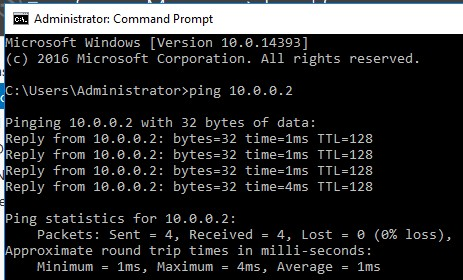

---

# Troubleshooting Examples

## Problem I
User got locked out

## Solution
Unlock user via AD Users and Computers
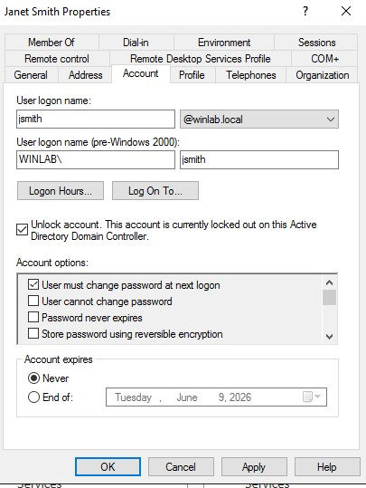

### Problem II
Client could not join the domain.

### Solution
Configured the correct DNS server and verified connectivity using ping.
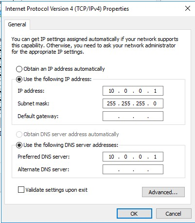

#### Problem III
User forgot password

#### Solution
Reseted user's password
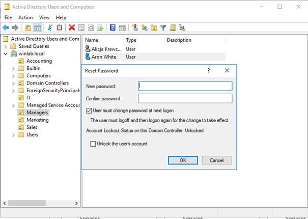

---

# Author

Barbara Bielecka
